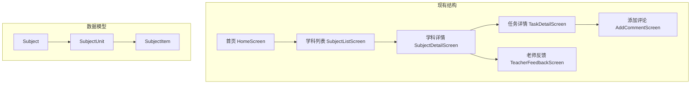
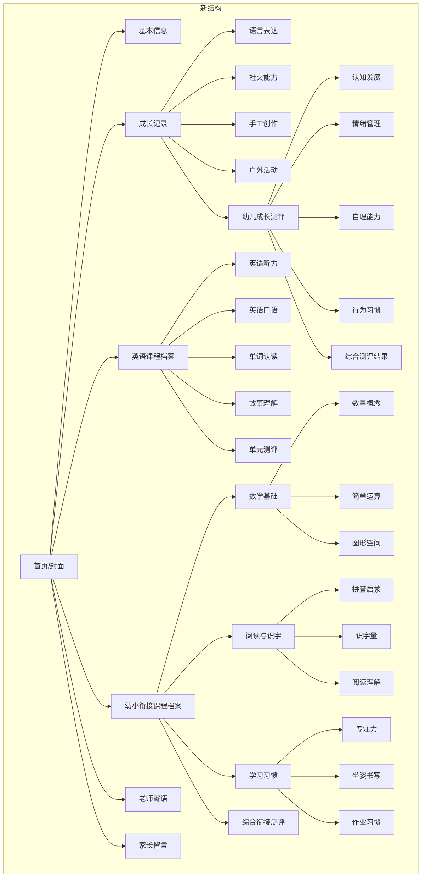

# 成长档案结构调整 - 架构计划

## 概述

将现有的小学学科表现原型调整为幼儿园成长档案结构，支持新的三级分类体系。

## 当前架构分析



## 目标架构



## 实施阶段

### Phase 1: 数据模型重构
- [x] 1.1 更新 `types.ts` - 新增支持三级分类的类型定义
- [ ] 1.2 重构 `constants.ts` - 按新结构组织数据
  - [ ] 1.2.1 用户信息（幼儿园场景）
  - [ ] 1.2.2 成长记录数据
  - [ ] 1.2.3 英语课程档案数据
  - [ ] 1.2.4 幼小衔接课程档案数据
  - [ ] 1.2.5 老师寄语和家长留言数据

### Phase 2: 首页重构
- [ ] 2.1 更新首页用户信息展示（幼儿园场景）
- [ ] 2.2 重新设计首页导航卡片
  - [ ] 成长记录
  - [ ] 英语课程档案
  - [ ] 幼小衔接课程档案
  - [ ] 老师寄语
  - [ ] 家长留言
- [ ] 2.3 调整学期进度信息

### Phase 3: 板块列表页面
- [ ] 3.1 创建通用的板块列表组件 `SectionListScreen`
- [ ] 3.2 支持两级/三级分类展示
- [ ] 3.3 保留三种视图模式（结构/卡片/时间线）

### Phase 4: 分类详情页面
- [ ] 4.1 创建分类详情组件 `CategoryDetailScreen`
- [ ] 4.2 支持子分类展示（幼小衔接的嵌套结构）
- [ ] 4.3 记录项列表展示

### Phase 5: 记录详情页面
- [ ] 5.1 调整记录详情页面适配幼儿园场景
- [ ] 5.2 支持不同类型记录的展示（观察记录、作品、测评、活动）
- [ ] 5.3 家长点评功能保留

### Phase 6: 老师寄语和家长留言
- [ ] 6.1 创建老师寄语列表页面
- [ ] 6.2 创建家长留言列表页面
- [ ] 6.3 详情展示和互动功能

### Phase 7: 路由和导航
- [ ] 7.1 更新路由配置
- [ ] 7.2 更新底部导航
- [ ] 7.3 面包屑导航支持

## 文件变更清单

| 文件 | 操作 | 说明 |
|------|------|------|
| `types.ts` | 修改 | 新增 Section, Category, Subcategory, RecordItem 类型 |
| `constants.ts` | 重写 | 按新结构组织所有数据 |
| `App.tsx` | 重写 | 更新所有页面组件和路由 |
| `components/BottomNav.tsx` | 修改 | 适配新导航结构 |

## 新增类型定义

```typescript
// 记录项（最小单位）
interface RecordItem {
  id: string;
  title: string;
  type: 'observation' | 'artwork' | 'assessment' | 'activity' | 'feedback';
  date: string;
  summary?: string;
  tags?: string[];
  image?: string;
  scoreLabel?: string;
  teacherFeedback?: TeacherFeedback;
}

// 子分类（可选的第三级）
interface Subcategory {
  id: string;
  name: string;
  items: RecordItem[];
}

// 分类（第二级）
interface Category {
  id: string;
  name: string;
  icon: string;
  items?: RecordItem[];           // 直接包含记录项
  subcategories?: Subcategory[];  // 或包含子分类
}

// 板块（第一级）
interface Section {
  id: string;
  name: string;
  icon: string;
  categories: Category[];
}
```

## 路由规划

| 路由 | 页面 | 说明 |
|------|------|------|
| `/` | HomeScreen | 首页/封面 |
| `/info` | BasicInfoScreen | 基本信息 |
| `/section/:id` | SectionScreen | 板块详情（成长记录/英语/幼小衔接） |
| `/category/:sectionId/:categoryId` | CategoryScreen | 分类详情 |
| `/subcategory/:sectionId/:categoryId/:subId` | SubcategoryScreen | 子分类详情 |
| `/record/:id` | RecordDetailScreen | 记录详情 |
| `/teacher-messages` | TeacherMessagesScreen | 老师寄语 |
| `/parent-messages` | ParentMessagesScreen | 家长留言 |
| `/add-comment` | AddCommentScreen | 添加评论 |

## 风险与注意事项

1. **数据迁移**: 现有的 Subject/Unit/Item 结构需要完全替换为新的 Section/Category/Item 结构
2. **嵌套层级**: 幼小衔接课程有三级嵌套，需要确保 UI 能够清晰展示
3. **视图兼容**: 三种视图模式需要适配新的数据结构
4. **场景转换**: 所有文案需要从小学场景调整为幼儿园场景

## 验收标准

- [ ] 首页展示所有主要板块入口
- [ ] 成长记录支持5个分类，其中"幼儿成长测评"有5个子分类
- [ ] 英语课程档案支持5个分类
- [ ] 幼小衔接课程档案支持4个分类，其中3个有子分类
- [ ] 老师寄语和家长留言独立板块
- [ ] 所有视图模式正常工作
- [ ] 导航流畅，层级清晰

---

## 架构审查结论 (2025-11-28)

### 审查结果: ✅ 方案可行

### 关键决策

1. **采用完全重构方案** - 不做渐进迁移，一次性替换数据模型和页面结构
2. **简化路由设计** - 使用 `/section/:id` 统一入口，内部通过组件状态管理层级
3. **保留视图模式** - 三种视图继续支持，适配新数据结构

### 实施优先级

```
Phase 1 (数据层) → Phase 2 (首页) → Phase 3 (板块列表) → Phase 4-6 (详情页) → Phase 7 (导航)
```

### 预估工作量

| 阶段 | 预估时间 | 复杂度 |
|------|----------|--------|
| Phase 1: 数据模型 | 15分钟 | 低 |
| Phase 2: 首页重构 | 20分钟 | 中 |
| Phase 3: 板块列表 | 30分钟 | 高 |
| Phase 4-6: 详情页 | 25分钟 | 中 |
| Phase 7: 导航 | 10分钟 | 低 |

**总计**: 约 100 分钟

### 下一步

执行 `SS` 命令开始逐步实施。
